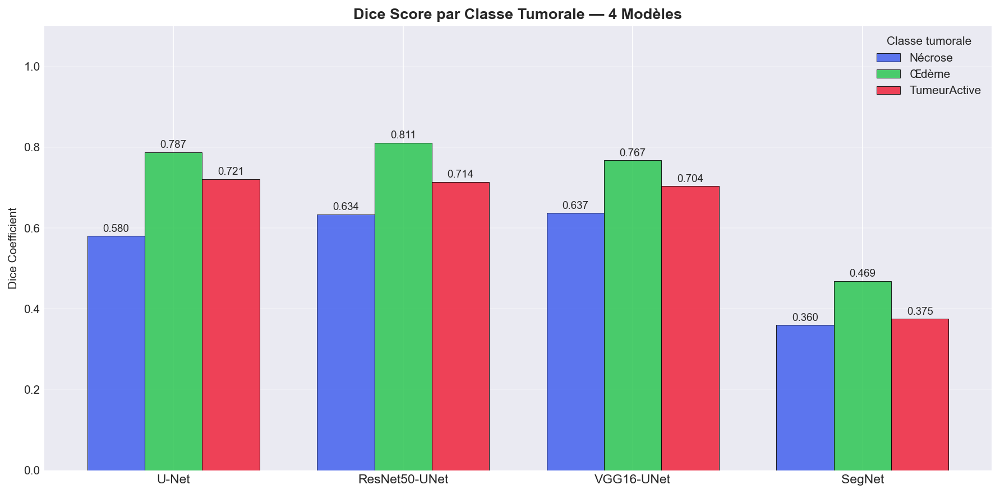

# Segmentation de tumeurs cérébrales avec BraTS2020

J'ai créé ce projet avec TOURAS Adam dans le cadre de mon projet de fin d'année en IA et Data (4IIR). Mon objectif était de comparer quatre architectures de réseaux de neurones pour segmenter des tumeurs cérébrales à partir d'images IRM du dataset BraTS2020.

J'ai regroupé le travail dans un notebook : chargement des données, préparation des coupes, définition des modèles, entraînement, évaluation et comparaison des prédictions.

## Pourquoi j'ai fait ce projet

Je voulais comparer plusieurs architectures sur les mêmes données et examiner leurs résultats, aussi bien avec des métriques qu'avec des visualisations des masques prédits. J'ai choisi de travailler sur des coupes 2D et de combiner trois modalités IRM : T1ce, T2 et FLAIR.

## Ce que j'ai mis en place

- Chargement des volumes et des masques au format NIfTI avec NiBabel.
- Normalisation min-max des volumes et redimensionnement des coupes en 128 × 128 pixels.
- Conversion des labels BraTS `0, 1, 2, 4` en `0, 1, 2, 3` : fond, nécrose, œdème et tumeur active.
- Comparaison de U-Net, ResNet50 avec un décodeur U-Net, VGG16 avec un décodeur U-Net et une variante de SegNet utilisant `UpSampling2D`.
- Utilisation de poids ImageNet pour les encodeurs ResNet50 et VGG16.
- Entraînement avec une perte combinant entropie croisée et Dice, sauvegarde des modèles, arrêt anticipé et réduction du taux d'apprentissage.
- Calcul du Dice global et par classe, du Mean IoU, de l'accuracy, de la précision, de la sensibilité et de la spécificité.
- Génération de courbes, de graphiques comparatifs, de matrices de confusion et de rapports de classification.
- Affichage des prédictions à côté des masques de référence.

## Technologies utilisées

J'ai utilisé Python 3.12.10 et un notebook Jupyter. Le calcul des modèles repose sur TensorFlow/Keras. J'ai utilisé NumPy et pandas pour manipuler les données, NiBabel et scikit-image pour préparer les images, scikit-learn pour le découpage et les rapports, et Matplotlib/Seaborn pour les graphiques. Le notebook importe aussi OpenCV et tqdm.

J'ai relevé les versions des dépendances dans l'environnement local et les ai consignées dans `requirements.txt`. Une installation neuve avec ces versions reste à vérifier ; je ne présente pas ce fichier comme un environnement déjà testé sur toutes les plateformes.

## Installation

### 1. Récupérer le projet

```bash
git clone https://github.com/KELLAM-Safeyeddine/brain-tumor-segmentation-brats2020.git
cd brain-tumor-segmentation-brats2020
```

### 2. Créer un environnement Python

Sous Windows, avec Python 3.12 installé :

```powershell
py -3.12 -m venv .venv
.\.venv\Scripts\Activate.ps1
python -m pip install --upgrade pip
python -m pip install -r requirements.txt
```

Sous Linux ou macOS, avec Python 3.12 disponible :

```bash
python3.12 -m venv .venv
source .venv/bin/activate
python -m pip install --upgrade pip
python -m pip install -r requirements.txt
```

Pour lancer une interface Jupyter dans le navigateur :

```bash
python -m pip install notebook
python -m notebook
```

J'ouvre ensuite `PFA-Final.ipynb` et je sélectionne le noyau correspondant à mon environnement. Je peux aussi ouvrir le notebook dans un éditeur compatible Jupyter, avec ce même environnement Python.

### 3. Préparer les données

J'ai utilisé le [dataset BraTS2020 disponible sur Kaggle](https://www.kaggle.com/datasets/awsaf49/brats20-dataset-training-validation). Les données ne sont pas incluses dans ce dépôt.

Après téléchargement et extraction, je remplace la valeur d'exemple `"PATH"` de `DATA_PATH`, dans la section « Configuration Globale », par le chemin du dossier contenant les dossiers patients `BraTS20...`.

Pour chaque patient, le chargement attend les fichiers suivants, où `<patient>` correspond au nom du dossier :

```text
<patient>/
├── <patient>_t1ce.nii
├── <patient>_t2.nii
├── <patient>_flair.nii
└── <patient>_seg.nii
```

Le code attend des fichiers `.nii`. Si mon téléchargement contient des fichiers `.nii.gz`, je dois les décompresser ou adapter le chargement avant de lancer cette étape.

## Utilisation

La configuration présente dans le notebook utilise au maximum 50 patients, 100 coupes par patient à partir de la coupe 22, des images de 128 × 128 pixels, 10 époques, des lots de 16 et un taux d'apprentissage de `0.001`.

Je charge les données en mémoire, puis je les répartis en 70 % pour l'entraînement, 15 % pour la validation et 15 % pour le test. Les sorties enregistrées montrent 5 000 coupes pour cette exécution.

### Refaire l'entraînement

Les appels d'entraînement de la section 6 sont actuellement commentés. Pour entraîner les quatre modèles, je décommente les appels à `train_model` et les lignes qui enregistrent leurs historiques et leurs durées, puis j'exécute les cellules dans l'ordre.

Le notebook crée `checkpoints/` et `logs/`. Les modèles sauvegardés ont les noms suivants :

```text
checkpoints/best_U-Net.h5
checkpoints/best_ResNet50-UNet.h5
checkpoints/best_VGG16-UNet.h5
checkpoints/best_SegNet.h5
```

### Réutiliser des modèles déjà entraînés

Je place ces quatre fichiers dans `checkpoints/`, je laisse les appels d'entraînement commentés et j'exécute la cellule de chargement après les définitions des architectures et des métriques personnalisées.

Les modèles ne sont pas versionnés : ils occupent environ 1,49 Go au total. Sans ces fichiers et sans nouvel entraînement, l'exécution complète s'arrête à la cellule de chargement. Les encodeurs ImageNet peuvent aussi nécessiter un téléchargement lors de leur première création.

Le chargement des données et les quatre architectures demandent de la mémoire. Les sorties conservées dans le notebook indiquent une exécution sans GPU ; je n'ai pas mesuré les besoins sur d'autres machines.

## Résultats enregistrés

J'ai conservé les graphiques et les historiques CSV dans `logs/`, ainsi que les sorties du notebook. Voici quelques scores de l'évaluation enregistrée, arrondis à quatre décimales :

| Modèle | Mean IoU | Dice nécrose | Dice œdème | Dice tumeur active |
|---|---:|---:|---:|---:|
| U-Net | 0.7020 | 0.5803 | 0.7872 | 0.7212 |
| ResNet50-UNet | 0.7437 | 0.6338 | 0.8112 | 0.7143 |
| VGG16-UNet | 0.7345 | 0.6373 | 0.7670 | 0.7037 |
| SegNet | 0.4711 | 0.3598 | 0.4687 | 0.3748 |

Ces scores proviennent des sorties sauvegardées ; je n'ai pas relancé l'entraînement pour préparer ce dépôt.



## Limites de mon approche

- Je découpe actuellement les données par coupe et non par patient. Des coupes d'un même patient peuvent donc apparaître dans plusieurs ensembles, ce qui peut rendre l'évaluation trop optimiste.
- Le Dice global inclut le fond. Je consulte aussi les scores par classe pour examiner les régions tumorales.
- Le traitement 2D ne prend pas en compte le contexte entre les coupes d'un volume.
- Le redimensionnement en 128 × 128 réduit le détail des images.
- Mon modèle nommé SegNet utilise un suréchantillonnage simple ; il ne réutilise pas les indices de max-pooling malgré le commentaire présent dans sa définition.
- Les CSV ne contiennent pas les durées d'entraînement. Les temps affichés à zéro dans l'évaluation correspondent à des valeurs manquantes.
- La section d'interprétation du notebook contient un classement attendu et des pistes générales. Je ne les considère pas comme des résultats mesurés de cette exécution.

## Structure du dépôt

```text
brain-tumor-segmentation-brats2020/
├── PFA-Final.ipynb
├── README.md
├── requirements.txt
├── .gitignore
└── logs/
    ├── history_*.csv
    ├── training_curves.png
    ├── comparison_bars.png
    ├── dice_per_class.png
    ├── radar_chart.png
    └── confusion_matrices.png
```

Je garde les données, les modèles, les environnements virtuels et les fichiers de configuration sensibles hors du dépôt grâce au `.gitignore`.

## Améliorations futures

Je souhaite d'abord séparer les données par patient pour rendre la comparaison plus fiable. Les pistes déjà évoquées dans le notebook comprennent l'augmentation des données, une perte adaptée au déséquilibre des classes, une résolution plus élevée, un modèle 3D, des mécanismes d'attention et une combinaison des prédictions des quatre modèles. Ces pistes ne sont pas implémentées dans la version actuelle.

## Auteurs

KELLAM Safeyeddine et TOURAS Adam.

Pour retrouver mon travail : [profil GitHub de KELLAM Safeyeddine](https://github.com/KELLAM-Safeyeddine).

Je n'ai pas choisi de licence pour le moment.
